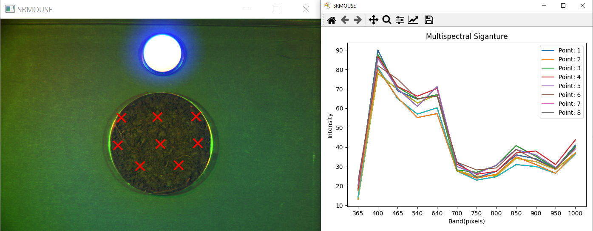

# Soil Muse Reflectance

Pipeline for the soil analysis using the Muse Camera

## Expected project distribution 

The following file distribution need to be set in order to work with the SRMouse package

```
📦data
 ┣ 📂Calibration
 ┃ ┣ 📜calibration.bfl
 ┃ ┗ 📜calibration.bfl.log
 ┣ 📂Project Name
 ┃ ┣ 📂Data
 ┃ ┃ ┣ 📜Spectrum_Data.txt
 ┃ ┃ ┗ 📜Spectrum_Data.xlsx
 ┃ ┣ 📂Images
 ┃ ┃ ┣ 📜Program_screenshot.PNG
 ┃ ┃ ┗ 📜RGB_image.png
 ┃ ┗ 📂Spectral_Cube
 ┃ ┃ ┣ 📜CPR-ATL-KET_control.xml
 ┃ ┃ ┣ 📜image1000.jpg
 ┃ ┃ ┣ 📜image365.jpg
 ┃ ┃ ┣ 📜image400.jpg
 ┃ ┃ ┣ 📜image465.jpg
 ┃ ┃ ┣ 📜image540.jpg
 ┃ ┃ ┣ 📜image640.jpg
 ┃ ┃ ┣ 📜image700.jpg
 ┃ ┃ ┣ 📜image750.jpg
 ┃ ┃ ┣ 📜image800.jpg
 ┃ ┃ ┣ 📜image850.jpg
 ┃ ┃ ┣ 📜image900.jpg
 ┃ ┃ ┗ 📜image950.jpg
```

## Installation 

1. Create a virtual environment 

```bash
python3 -m venv .venv 
```

2. Activate your environment

```bash
source .venv/bin/activate 
```

3. Install the build module 

```bash 
python -m pip install build
```

4. Build the package 

```bash
python -m build
```

5. Install the package

```bash
python -m pip install -e .
```

6. Import the package in your project 

```python 
import srmouse 
```

7. Initial results can be seen in the [Notebook](https://github.com/jrojas9206/soilMuseReflectance/blob/main/notebook/241119_demo.ipynb)

## SRMouse UI 

To call a GUI that allows you to obtain your signature fast, you can call the *SRMouse UI*. To called execture the following command.

```bash 
python -m srmouse.muse_app absolute/path/to/spectralCube  --scale=6 --kernelSize 4 4
```

After executing the command you will see something like the bottom figure 

<figure>
    <p align="center">
        
    </p>
        <figcaption><b>Figure.</b> UI to visualize the pixel values of the multispectral images.</figcaption>
<figure>